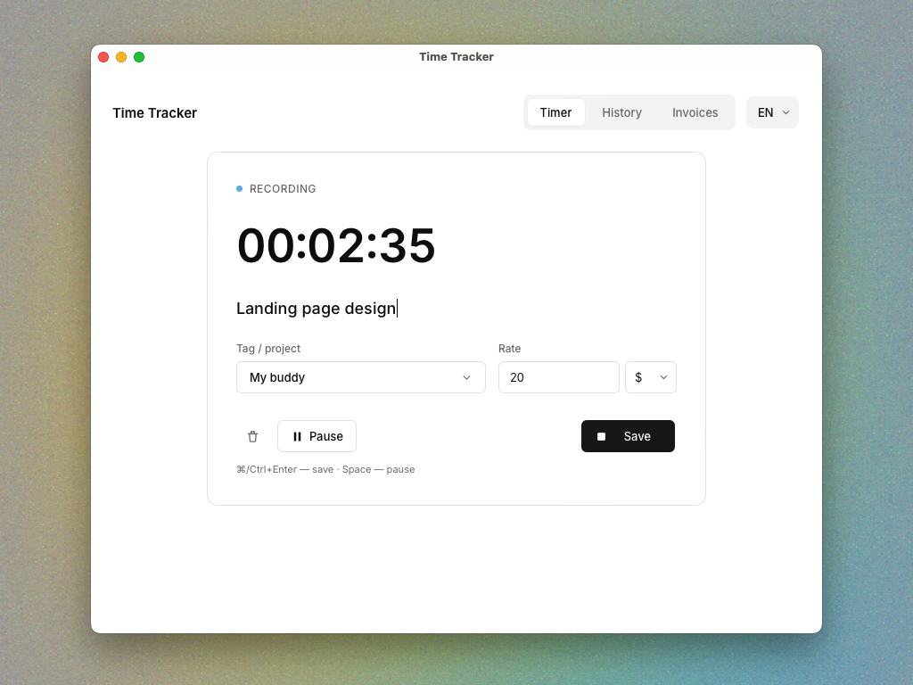
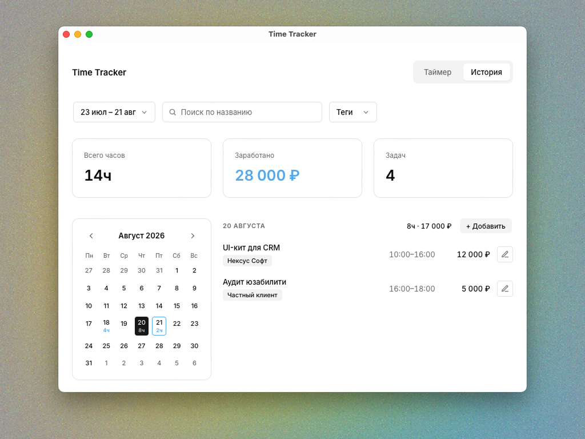
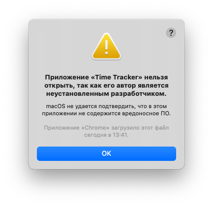
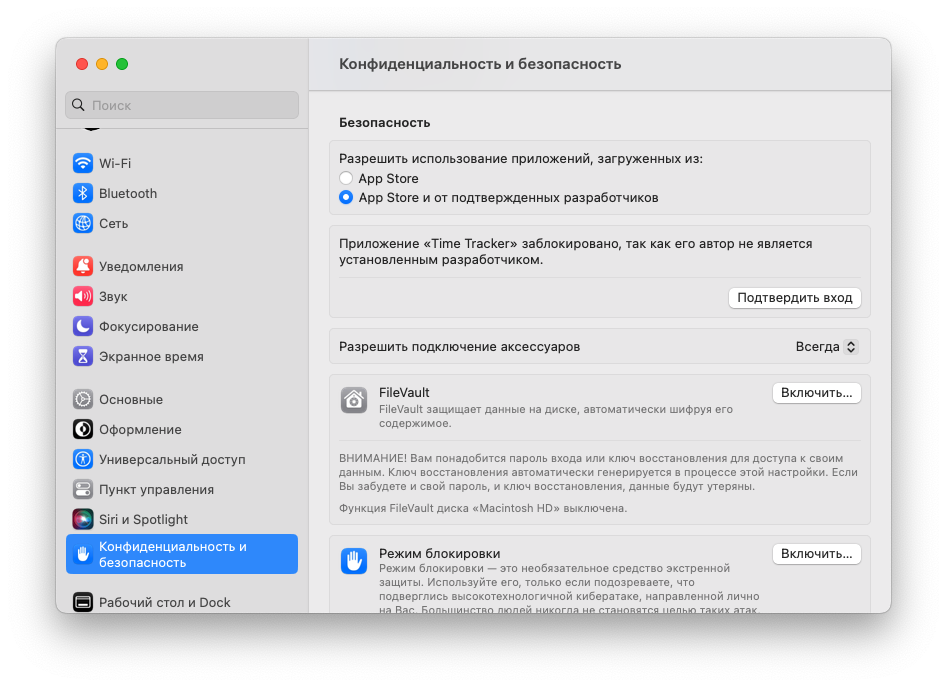
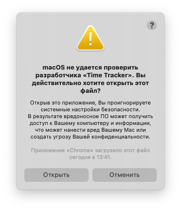

# Time Tracker

*[Читать на русском](README.ru.md)*

A macOS and Windows app for tracking hourly work. Start a timer as you work, keep a searchable history by task, see what you've earned over any period, and bill clients with a generated PDF invoice — no subscriptions, everything stays on your own computer.

|  |  |
|---|---|

Download ready-to-use installers: **[Releases → Time Tracker v0.1.0](https://github.com/konstantin-chirkov/time-tracker/releases/latest)**

## Features

- Time tracking — start, pause, and stop the timer in one click. Use keyboard shortcuts for faster work.
- Tags & rates — organize tasks with tags and set a rate and currency for each one.
- History — review your work in a calendar, search tasks, filter by tags, and edit past entries.
- Invoicing — generate PDF invoices for any project or period, add your signature, and keep an invoice history.

## Web version (the simplest way)

Nothing to install:

1. Download **`Time Tracker.html`**.
2. Open the file with a double-click — it opens in your default browser.
3. It works just like the regular app; data is saved in the browser itself (localStorage) on this device.

No security warnings from your system — it's just a file, not an executable program. One trade-off: if you clear your browser data, the history is lost (unlike the .dmg/.exe, where data doesn't depend on the browser).

If you'd rather have a full desktop app, see the installers for your system below.

## Install on Mac

Works on both new Macs (M1/M2/M3/M4) and older Intel machines.

1. Download and open **`Time Tracker.dmg`**.
2. Drag "Time Tracker" into the Applications folder.
3. On first launch, macOS blocks it as coming from an unidentified developer (normal — the app doesn't have a paid Apple signature). Screenshots below are from a Mac set to Russian, but the dialogs and buttons are in the same places on an English system:
   - Click **OK** on the warning.

     

   - Open **System Settings → Privacy & Security**, scroll down to the security section, and click **"Open Anyway"** next to Time Tracker.

     

   - Try opening the app again — a second dialog asks you to confirm. Click **"Open"**.

     
4. After that, the app opens with a regular double-click.

## Install on Windows

1. Download and run **`Time Tracker.exe`**.
2. Windows will show a SmartScreen warning ("Windows protected your PC") for the same reason (no paid signature). Click **"More info"** → **"Run anyway"**.
3. Go through the install wizard (Next → Next → Install).

## What's where

```
Time Tracker/
  README.md                 ← this file
  Web/                       ← no install, works on any system
    Time Tracker.html        ← open with a double-click in a browser
  macOS/                     ← for macOS (both M1 and Intel)
    Time Tracker.dmg         ← Mac installer
  Windows/                   ← for Windows
    Time Tracker.exe         ← Windows installer
```

Just go into the folder for your system and open the file inside — or use the Releases link above.
